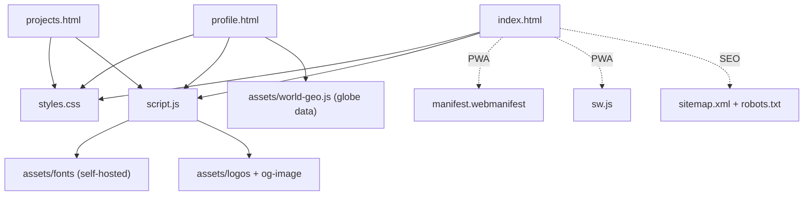
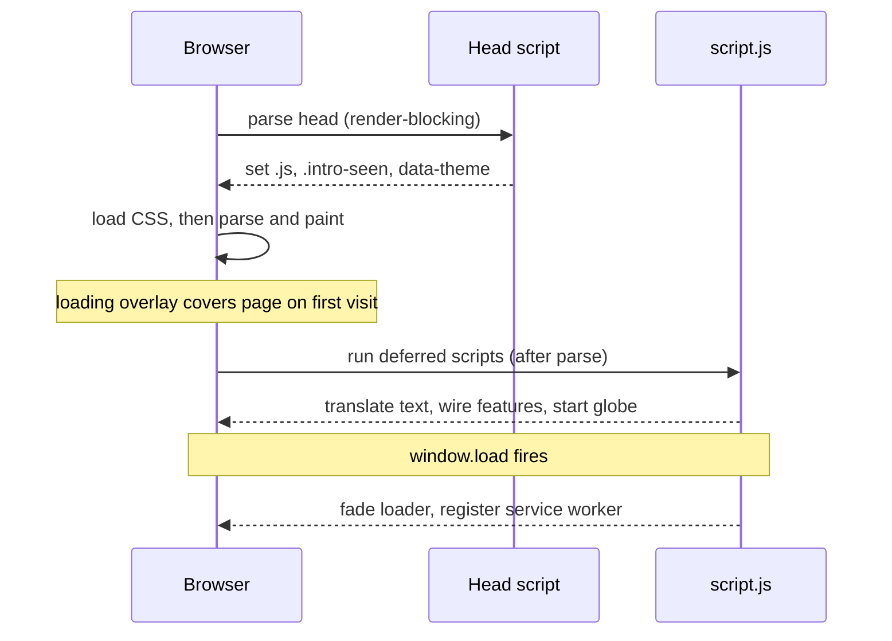
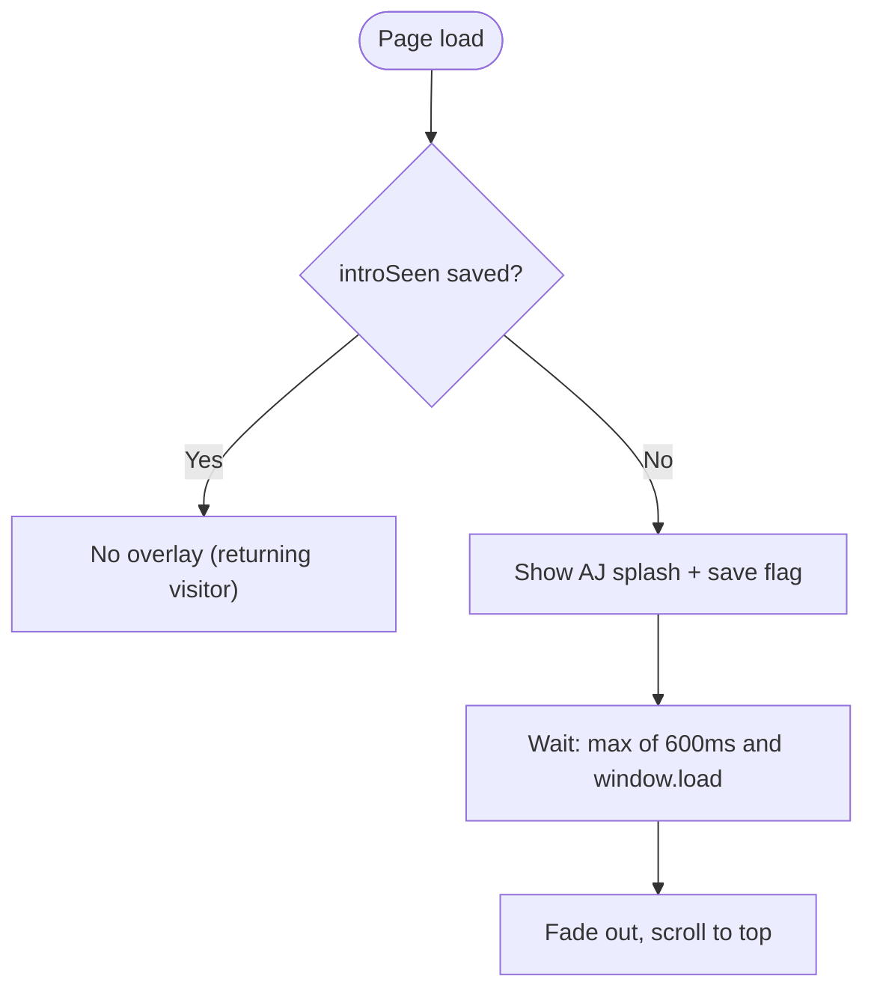

# Architecture

This document explains how the portfolio is built and how the pieces fit together. It is a **static, dependency-free, multi-page site** — plain HTML, CSS, and JavaScript with **no build step and no framework**. It is hosted on GitHub Pages and has no server-side code; every feature runs in the browser.

---

## 1. High-level overview

```
                         ┌───────────────────────────────┐
                         │        shared foundation        │
                         │   styles.css   +   script.js    │
                         └───────────────────────────────┘
                            ▲            ▲            ▲
              ┌─────────────┘            │            └─────────────┐
        ┌───────────┐            ┌───────────────┐          ┌──────────────┐
        │ index.html│            │  profile.html │          │ projects.html│
        │  landing  │            │ detailed CV   │          │ project deep │
        │           │            │  + globe      │          │ dive + GitHub│
        └───────────┘            └───────────────┘          └──────────────┘
              │                          │                          │
              │        all three pages pull the same chrome         │
              │   (nav, footer, loader, orbs) and behaviour from     │
              └──────────  styles.css + script.js  ──────────────────┘

  assets/  fonts (self-hosted) · logos · world-geo.js (globe data) · og-image · CV
  PWA:     manifest.webmanifest + sw.js        SEO: sitemap.xml · robots.txt
```

Rendered as a dependency graph (how each page connects to the shared code and assets):



Every page is hand-authored HTML that links the **same** `styles.css` and `script.js`. Shared UI (nav, footer, background orbs, loading overlay) is duplicated in each HTML file, while all *behaviour* and *styling* live in the two shared files.

---

## 2. Files and responsibilities

| File | Role |
|------|------|
| `index.html` | Landing page: hero, profile, featured projects, experience timeline, contact + form |
| `profile.html` | Detailed profile: education, internships, certifications, community, projects, skills. Hosts the interactive globe. Contains a page-specific `<style>` block. |
| `projects.html` | Per-year EPITECH project details + a live GitHub repositories section |
| `styles.css` | All shared styling, the light-theme overrides, and component styles |
| `script.js` | The single behaviour bundle (details below) |
| `assets/world-geo.js` | World GeoJSON wrapped as `window.WORLD_GEOJSON` (loaded only by `profile.html`) |
| `assets/fonts/` | Self-hosted Space Grotesk + Sora (`fonts.css` + `woff2`) |
| `sw.js` | Service worker — offline cache |
| `manifest.webmanifest` | PWA metadata (name, icons, theme color) |
| `sitemap.xml`, `robots.txt` | SEO |
| `favicon.svg` / `favicon.png` / `apple-touch-icon.png` | Icons |

### What `script.js` contains (in load order)
1. **Page-loader dismissal** — hides the intro overlay (first visit only).
2. **`translations` object** — all EN/FR strings, keyed by `data-i18n` names.
3. **`tr()` / `applyTranslations()`** — the i18n engine.
4. **`renderTechChips()`** — turns comma lists into chip elements.
5. **Language init + toggle wiring.**
6. **Reveal-on-scroll** IntersectionObserver.
7. **Scroll-spy** navigation.
8. **`initEarthGlobe()`** — the canvas globe engine.
9. **Scroll progress bar, theme toggle, GitHub fetch, contact form, service-worker registration.**

---

## 3. Page load sequence

Understanding the order matters because several features run *before paint* to avoid flashes.



The loading overlay only appears for genuinely new visitors — that decision is made in the head script before anything paints:



1. **`<head>` inline script (synchronous, blocks paint).** On every page it sets three things on `<html>` immediately:
   - `.js` class → enables JS-only CSS (reveal animations, loader, mobile nav collapse).
   - `.intro-seen` class if the visitor has been here before (from `localStorage`).
   - `data-theme="light|dark"` from `localStorage`, falling back to the OS `prefers-color-scheme`.
   Doing this here (not in `script.js`) means the correct theme and loader visibility are decided *before* the page renders — no flash of the wrong theme or an unwanted splash.
2. **CSS loads** (`fonts.css`, then `styles.css`) — render-blocking, so styling is ready on first paint.
3. **HTML parses and paints.** The loading overlay covers the page if it's a first visit.
4. **Deferred scripts run** after parsing, in document order:
   - `profile.html` only: `assets/world-geo.js` sets `window.WORLD_GEOJSON`.
   - `script.js` runs: applies translations, wires everything up, dismisses the loader, starts the globe.
5. **`window.load`** → the loader fades out (after a minimum display time), the service worker registers (HTTPS only).

---

## 4. Progressive enhancement (the core principle)

The site is built so the **content always works without JavaScript**, and JS only *enhances* it.

- CSS animations (`.reveal`, the loader, mobile-nav collapse) are gated behind the `.js` class. Without JS, that class is never added, so content is simply visible — no hidden sections, no stuck overlay, no broken menu.
- `prefers-reduced-motion` disables the globe rotation, hover transforms, orb drift, and hero stagger.
- Accessibility: focus-visible outlines, `aria-pressed` on toggles, `aria-label`s, `role="group"`, and a labelled language selector.

---

## 5. Internationalisation (i18n)

- Text is marked in HTML with attributes: `data-i18n` (sets `textContent`), `data-i18n-html` (sets `innerHTML`, for strings with markup), and `data-i18n-attr` (sets an attribute such as `placeholder` or a `<meta content>`).
- `applyTranslations(lang)` walks these attributes and fills in strings from the `translations` object. Elements that carry `data-i18n-attr` are **skipped** by the `textContent` pass (so inputs/meta/textarea only get their attribute translated, not their body).
- Language is stored in `localStorage["siteLang"]`; on a first visit the browser language is detected (`navigator.language`) and FR speakers get French automatically.
- `document.documentElement.lang` is kept in sync, and dynamic strings (form status, GitHub labels) read the current language via `tr()`.

---

## 6. Theming

- The palette is defined as CSS custom properties on `:root`. A `:root[data-theme="light"]` block overrides them plus a few hardcoded colors (meta text, footer, chips, orbs, dot grid, loader).
- The theme is applied pre-paint by the `<head>` script (see §3) and toggled by a button that `script.js` injects next to the language switch. The choice persists in `localStorage["theme"]`.

---

## 7. The globe (`profile.html` only)

- A 2D `<canvas>` renderer in `initEarthGlobe()`. Country outlines come from `window.WORLD_GEOJSON` (bundled in `assets/world-geo.js` and loaded via a `<script>` tag, which works over `file://` — unlike `fetch()`). If the data is missing, it falls back to hand-coded continent shapes.
- Performance safeguards: the animation is **capped at ~30 fps** and **paused whenever the canvas scrolls off-screen** (via an `IntersectionObserver`), so it uses no CPU while reading the rest of the page. It also respects reduced-motion and is pointer-draggable.

---

## 8. Feature modules in `script.js`

- **Loading overlay** — first-visit only (`localStorage["introSeen"]`), minimum 600 ms display, scrolls to top so the intro starts cleanly, safety timeout so it can never get stuck.
- **Scroll-spy** — an `IntersectionObserver` highlights the nav link whose target section is in view; matches the `#fragment` of same-page and cross-page links.
- **Scroll progress bar** — a fixed element created in JS, width updated on scroll.
- **Tech chips** — parses "Label: A, B, C" strings into styled chips, re-run on every language switch.
- **Contact form** — posts JSON to the Web3Forms API; shows localized "sending / success / error" status; includes a honeypot field. HTTPS only.
- **GitHub section** (`projects.html`) — `fetch`es recent public repos from the GitHub API and renders cards; degrades to a link on failure.

---

## 9. PWA / offline

- `manifest.webmanifest` makes the site installable (name, icons, standalone display, theme color).
- `sw.js` uses a **cache-first** strategy for same-origin `GET` requests: it precaches the core files on install, serves them from cache when available, and lets external requests (GitHub API, analytics) pass through untouched. Bump the `CACHE` version string to invalidate.
- Registered only in a secure context (`https:` or `localhost`), so it's inert during local `file://` testing and activates once deployed.

---

## 10. SEO, social, and analytics

- Each page has its own `<title>`, meta description, **canonical** URL, and **Open Graph / Twitter** tags pointing at `assets/og-image.png` (a 1200×630 preview card).
- `index.html` includes **JSON-LD** `Person` structured data (job title, schools, languages, social profiles).
- `sitemap.xml` + `robots.txt` support crawling.
- **GoatCounter** provides cookieless, privacy-friendly analytics (no consent banner required).

---

## 11. Performance choices

- **Self-hosted fonts** with `unicode-range` subsetting — unused character sets are never downloaded, and no request is made to Google (also a GDPR win for EU visitors).
- **Logos optimized** to a 160 px longest side (from ~1 MB down to ~80 KB total).
- **Scripts `defer`red** so the page is interactive before the large globe data parses.
- **Lazy-loaded images** (`loading="lazy"`).

### localStorage keys used
| Key | Purpose |
|-----|---------|
| `siteLang` | `"en"` / `"fr"` language preference |
| `theme` | `"light"` / `"dark"` theme preference |
| `introSeen` | marks that the loading intro has been shown |

---

## 12. Known trade-off

Because there is no build step, the shared chrome (`<head>` boilerplate, nav, footer, loader, orbs) is **copy-pasted across the three HTML files**. At this size it's manageable, but if the site grows to more pages, migrating to a static-site generator (e.g. Jekyll, which GitHub Pages builds natively) would let the shared layout be defined once. See the README for deployment details.
